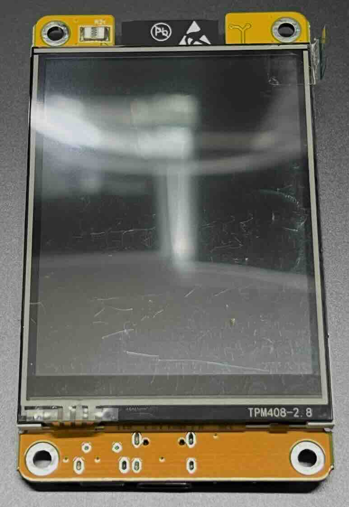
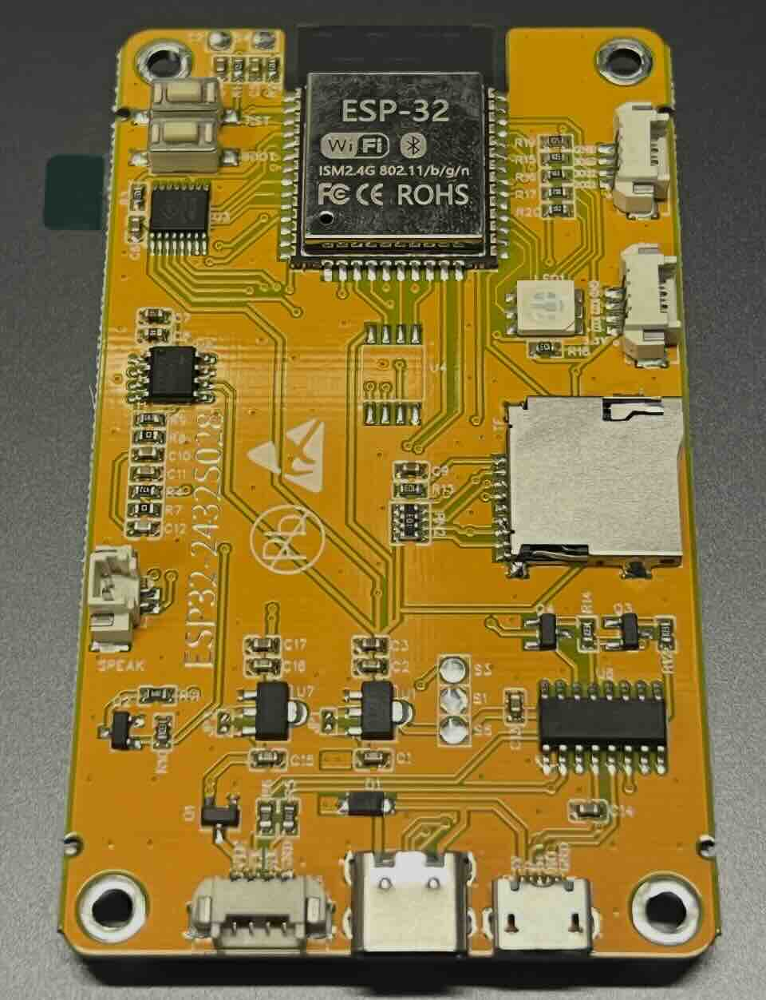

# ESP32-2432S028 LCD and XPT2046 Touch Calibration

Working test sketches for the **ESP32-2432S028** 2.8-inch TFT LCD board, including LCD color testing, raw touch reading, affine touch calibration, and calibrated touch testing.

## Board images

Place the board photos in the `images/` folder as shown below:

```text
images/
├── ESP32-2432S028_01.jpg
└── ESP32-2432S028_02.jpg
```

### Front side



### Back side



## Board identification from the photos

The tested board can be identified by the following visible markings and features:

- PCB silkscreen: **ESP32-2432S028**
- LCD panel marking: **TPM408-2.8**
- ESP-32 Wi-Fi/Bluetooth module on the back side
- 2.8-inch TFT LCD on the front side
- microSD card slot on the back side
- Several onboard connectors and buttons are visible on the PCB

The board appearance may vary slightly depending on the seller or production batch. Even when the PCB looks similar, the TFT_eSPI setup and touch calibration may still need to be checked.

## Target board

- Board: ESP32-2432S028
- Seller/brand style: AITEXM ROBOT ESP32-2432S028
- MCU: ESP32-WROOM series
- Display: 2.8-inch 240×320 TFT LCD
- Touch: XPT2046 resistive touch controller
- Display library: TFT_eSPI
- Touch library: XPT2046_Touchscreen

## Why this repository exists

Some ESP32-2432S028 boards show only a white screen, black screen, or noisy display when the TFT_eSPI setup does not match the board. Touch may also work while the display does not, because the display and touch controller use different SPI pins.

This repository provides a step-by-step way to check:

1. Whether the LCD display works
2. Whether raw touch data is being read
3. How to calculate affine calibration values
4. How to apply the calibration values in your own sketches

## Libraries

Install these libraries in Arduino IDE:

- `TFT_eSPI` by Bodmer
- `XPT2046_Touchscreen` by Paul Stoffregen

## TFT_eSPI setup

Copy this file:

```text
TFT_eSPI_Setup/User_Setup_ESP32_2432S028.h
```

into your TFT_eSPI library folder as `User_Setup.h`, or copy its content into your existing `User_Setup.h`.

Also check `User_Setup_Select.h` in the TFT_eSPI folder. Only this line should be active:

```cpp
#include <User_Setup.h>
```

Other board-specific setup includes such as TTGO T-Display or ST7789 presets should be commented out.

## Important rotation setting

The examples use this rotation combination:

```cpp
tft.setRotation(1);
ts.setRotation(0);
```

If you change either value, you should run the affine calibration again.

## Example order

### 1. LCD color test

Upload:

```text
examples/lcd_color_test/lcd_color_test.ino
```

The screen should repeatedly change:

```text
RED → GREEN → BLUE → WHITE → BLACK
```

If you see only white, black, or noise, check the TFT_eSPI setup first.

### 2. Raw touch test

Upload:

```text
examples/touch_raw_test/touch_raw_test.ino
```

Open the Serial Monitor at `115200 baud`. Touch the display and check whether raw `x`, `y`, and `z` values are printed.

### 3. Affine touch calibration

Upload:

```text
examples/affine_touch_calibration/affine_touch_calibration.ino
```

Touch the center of each cross mark and keep holding for about 1 second. The Serial Monitor will print affine calibration values:

```cpp
const float ax = ...;
const float bx = ...;
const float cx = ...;

const float ay = ...;
const float by = ...;
const float cy = ...;
```

### 4. Calibrated touch test

Upload:

```text
examples/calibrated_touch_test/calibrated_touch_test.ino
```

Replace the default calibration values in the sketch with the values printed by the calibration sketch.

## Example calibration values

The following values worked on one AITEXM ROBOT ESP32-2432S028 board:

```cpp
const float ax = 0.00003874;
const float bx = 0.08726453;
const float cx = -13.03474426;

const float ay = -0.06659155;
const float by = 0.00032632;
const float cy = 256.75961304;
```

These values are board-specific. Please run the calibration sketch for your own board.

## Display pins used in this setup

```cpp
#define TFT_MISO 12
#define TFT_MOSI 13
#define TFT_SCLK 14
#define TFT_CS   15
#define TFT_DC    2
#define TFT_RST  -1
#define TFT_BL   21
```

## Touch pins

```cpp
#define XPT2046_IRQ  36
#define XPT2046_MOSI 32
#define XPT2046_MISO 39
#define XPT2046_CLK  25
#define XPT2046_CS   33
```

## Troubleshooting

See:

```text
docs/TROUBLESHOOTING.md
```

## Notes

- The sample photos are included only to help identify the tested board variant.
- If your board has different markings or a different LCD controller, the TFT_eSPI setup may need to be changed.
- The affine calibration values above are only an example. Always run the calibration sketch for accurate touch input.

## License

MIT License
